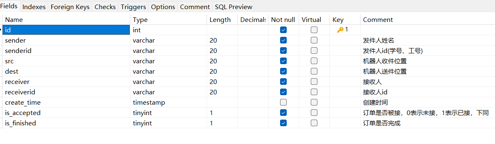

# 订单管理实现及接口设计

## 订单结构设计


## 订单管理流程
- 首先由用户(小程序端)向后端发送第一次订单信息，在数据库种生成并创建一条仅包含发件人基础信息的订单
- 生成订单后，用户端向后端定时发送请求，用于更新订单信息
- 后端在获取订单后，向机器人发送订单信息，该功能由机器人向后端定时发送get请求实现
- 机器人到达用户(指定?固定?)地点后，获取到收件人信息，通过post请求更新订单信息
- 在订单更新后，第二步用户端的更新请求可以得到正确响应，在界面更新订单信息，此时更换请求，请求订单完成信息
- 机器人到达收件人位置，完成订单后，机器人向后端发送post请求，更新订单信息，标记为完成
- 这里用户端的请求再一次被正确响应，完成订单

//服务端前端未体现

## 接口设计

- baseurl: http://ip:port/delivery
- 以下接口均已测试无误


- 用户第一次创建订单接口
```java
/**
     * 小程序端第一次向后端发送订单信息
     * @param delivery 发送的信息，应当包括sender/senderid/src三个基本信息
     * @return 返回Result，包括信息和数据
     */
    @PostMapping("/user/send")
    public Result sendOrder(@RequestBody Delivery delivery) {
        if(CodeUtils.checkSender(delivery)) {
            return Result.error(Constants.CODE_400, "参数错误");
        }
        return Result.success(deliveryMapper.insert(delivery));
    }
```

- 创建订单后用户获取更新订单接口
```java
/**
     * 小程序向后端请求订单是否被接收
     * @param delivery 未更新订单
     * @return 查询更新订单的结果
     */
    @PostMapping("/user/accept")
    public Result queryOrder(@RequestBody Delivery delivery) {
        if(CodeUtils.checkSender(delivery)) {
            return Result.error(Constants.CODE_400, "参数错误");
        }

        QueryWrapper<Delivery> queryWrapper = new QueryWrapper<>();
        queryWrapper.eq("sender", delivery.getSender());
        queryWrapper.eq("senderid", delivery.getSenderid());
        queryWrapper.eq("is_accepted", true);
        Delivery order = deliveryMapper.selectOne(queryWrapper);
        if(order == null) {
            return Result.error(Constants.CODE_402, "当前无此订单");
        }
        return Result.success(order);
    }
```

- 用户查询订单是否完成接口
```java
/**
     * 订单完成接口,当小程序端查询到订单后请求该接口
     * @param delivery 订单信息
     * @return 未被接收(避免该情况)、未完成、完成 3种情况
     */
    @PostMapping("/user/finish")
    public Result finishOrderU(@RequestBody Delivery delivery) {
        if(CodeUtils.checkSender(delivery)) {
            return Result.error(Constants.CODE_400, "参数错误");
        }

        QueryWrapper<Delivery> queryWrapper = new QueryWrapper<>();
        queryWrapper.eq("sender", delivery.getSender());
        queryWrapper.eq("senderid", delivery.getSenderid());
        queryWrapper.eq("is_accepted", true);
        queryWrapper.eq("is_finished", true);
        Delivery order = deliveryMapper.selectOne(queryWrapper);
        if(order == null) {
            queryWrapper.clear();
            queryWrapper.eq("sender", delivery.getSender());
            queryWrapper.eq("senderid", delivery.getSenderid());
            queryWrapper.eq("is_accepted", true);
            queryWrapper.eq("is_finished", false);
            order = deliveryMapper.selectOne(queryWrapper);
            if(order == null) {
                return Result.error(Constants.CODE_402, "当前无此订单，可能未被机器人接收");
            }
            return Result.error(Constants.CODE_402, "当前订单未完成");
        }
        return Result.success(order);
    }
```

- 机器人获取订单接口
```java
/**
     * 机器人获取订单接口
     * @return id最小的(最先提交的)订单
     * ?同时访问数据
     */
    @GetMapping("/robot")
    public Result getOrder() {
        QueryWrapper<Delivery> queryWrapper = new QueryWrapper<>();
        queryWrapper.eq("is_accepted", 0);
        queryWrapper.eq("is_finished", 0);

        List<Delivery> deliveries = deliveryMapper.selectList(queryWrapper);
        if(deliveries.size() == 0) {
            return Result.error(Constants.CODE_402, "没有待处理订单");
        }
        return Result.success(CodeUtils.selectOrder(deliveries));
    }
```

- 机器人更新订单接口
```java
/**
     * 到达发件人地址后，机器人接收收件人信息，再更新订单信息
     * @param delivery 更新的订单
     * @return 操作结果
     */
    @PostMapping("/robot/update")
    public Result updateOrder(@RequestBody Delivery delivery) {
        if(CodeUtils.checkSender(delivery)) {
            return Result.error(Constants.CODE_400, "参数错误");
        }

        if(CodeUtils.checkReceiver(delivery)) {
            return Result.error(Constants.CODE_400, "无效参数");
        }
        QueryWrapper<Delivery> queryWrapper = new QueryWrapper<>();
        queryWrapper.eq("sender", delivery.getSender());
        queryWrapper.eq("senderid", delivery.getSenderid());
        queryWrapper.eq("is_accepted", 0);
        queryWrapper.eq("is_finished", 0);
        return Result.success(deliveryMapper.update(delivery, queryWrapper));
    }
```

- 机器人完成订单接口
```java
/**
     * 结束送货任务后，更新订单信息
     * @param delivery 订单
     * @return 操作结果
     */
    @PostMapping("/robot/finish")
    public Result finishOrderR(@RequestBody Delivery delivery) {
        if(CodeUtils.checkSender(delivery) || CodeUtils.checkReceiver(delivery)) {
            return Result.error(Constants.CODE_400, "参数错误");
        }

        QueryWrapper<Delivery> queryWrapper = new QueryWrapper<>();
        queryWrapper.eq("sender", delivery.getSender());
        queryWrapper.eq("senderid", delivery.getSenderid());
        queryWrapper.eq("receiver", delivery.getReceiver());
        queryWrapper.eq("receiverid", delivery.getReceiverid());
        queryWrapper.eq("is_accepted", 1);
        queryWrapper.eq("is_finished", 0);
        Delivery one = deliveryMapper.selectOne(queryWrapper);
        if(one == null) {
            return Result.error(Constants.CODE_402, "当前没有该待处理订单");
        }
        return Result.success(deliveryMapper.update(delivery, queryWrapper));
    }
```


